# Arquitectura del Sistema — APPATITAS
**Versión:** 1.0
**Fuente:** `docs/SDD_MASTER.md` v1.1 · `docs/adrs/` · `docs/architecture/`
**Fecha:** Mayo 2025

Todo elemento de este documento tiene origen trazable en el SDD_MASTER.
Los elementos marcados con `*` tienen gaps documentados en `docs/GAP_ANALYSIS.md`.

---

## 1. Visión General del Sistema

APPATITAS es una Progressive Web App (PWA) que opera sobre Supabase como backend único. La arquitectura es **serverless-first**: no existe servidor de aplicación propio. Toda la lógica de backend corre en Supabase Edge Functions (Deno) o en la base de datos mediante Row Level Security y procedimientos.

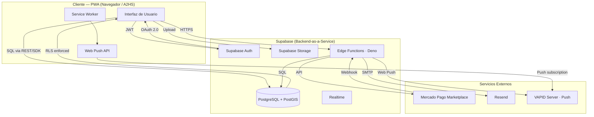
```mermaid
graph TB
    subgraph Cliente["Cliente — PWA (Navegador / A2HS)"]
        UI[Interfaz de Usuario]
        SW[Service Worker]
        WP[Web Push API]
    end

    subgraph Supabase["Supabase (Backend-as-a-Service)"]
        AUTH[Supabase Auth]
        DB[(PostgreSQL + PostGIS)]
        STR[Supabase Storage]
        EF[Edge Functions · Deno]
        RT[Realtime]
    end

    subgraph Externos["Servicios Externos"]
        MP[Mercado Pago Marketplace]
        RS[Resend]
        VAPID[VAPID Server · Push]
    end

    UI -->|JWT| AUTH
    UI -->|SQL via REST/SDK| DB
    UI -->|Upload| STR
    UI -->|HTTPS| EF

    SW --> WP
    WP -->|Push subscription| VAPID

    AUTH -->|OAuth 2.0| UI
    DB -->|RLS enforced| UI

    EF -->|SMTP| RS
    EF -->|Web Push| VAPID
    EF -->|SQL| DB
    EF -->|API| MP

    MP -->|Webhook| EF
```

---

## 2. Arquitectura Frontend — PWA

### 2.1 Capas de la PWA

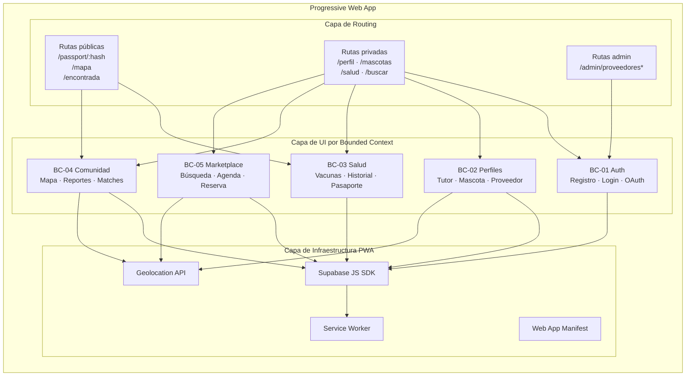
```mermaid
graph TB
    subgraph PWA["Progressive Web App"]
        direction TB

        subgraph Router["Capa de Routing"]
            PUB[Rutas públicas\n/passport/:hash\n/mapa\n/encontrada]
            PRIV[Rutas privadas\n/perfil · /mascotas\n/salud · /buscar]
            ADMIN[Rutas admin\n/admin/proveedores*]
        end

        subgraph UI["Capa de UI por Bounded Context"]
            BC01[BC-01 Auth\nRegistro · Login · OAuth]
            BC02[BC-02 Perfiles\nTutor · Mascota · Proveedor]
            BC03[BC-03 Salud\nVacunas · Historial · Pasaporte]
            BC04[BC-04 Comunidad\nMapa · Reportes · Matches]
            BC05[BC-05 Marketplace\nBúsqueda · Agenda · Reserva]
        end

        subgraph Infra["Capa de Infraestructura PWA"]
            SDK[Supabase JS SDK]
            GEO[Geolocation API]
            SW2[Service Worker]
            MAN[Web App Manifest]
        end
    end

    PUB --> BC03
    PUB --> BC04
    PRIV --> BC01
    PRIV --> BC02
    PRIV --> BC03
    PRIV --> BC04
    PRIV --> BC05
    ADMIN --> BC01

    BC01 --> SDK
    BC02 --> SDK
    BC02 --> GEO
    BC03 --> SDK
    BC04 --> SDK
    BC04 --> GEO
    BC05 --> SDK
    BC05 --> GEO

    SDK --> SW2
```

### 2.2 Rutas públicas sin autenticación

Según el SDD, tres rutas son accesibles sin sesión:

| Ruta | Módulo | HU |
|---|---|---|
| `/passport/{hash}` | Pasaporte compartido | HU-011 |
| `/mapa` | Mapa comunitario de alertas | HU-013 |
| `/encontrada` | Formulario de mascota encontrada | HU-014 |

### 2.3 Service Worker y capacidades PWA

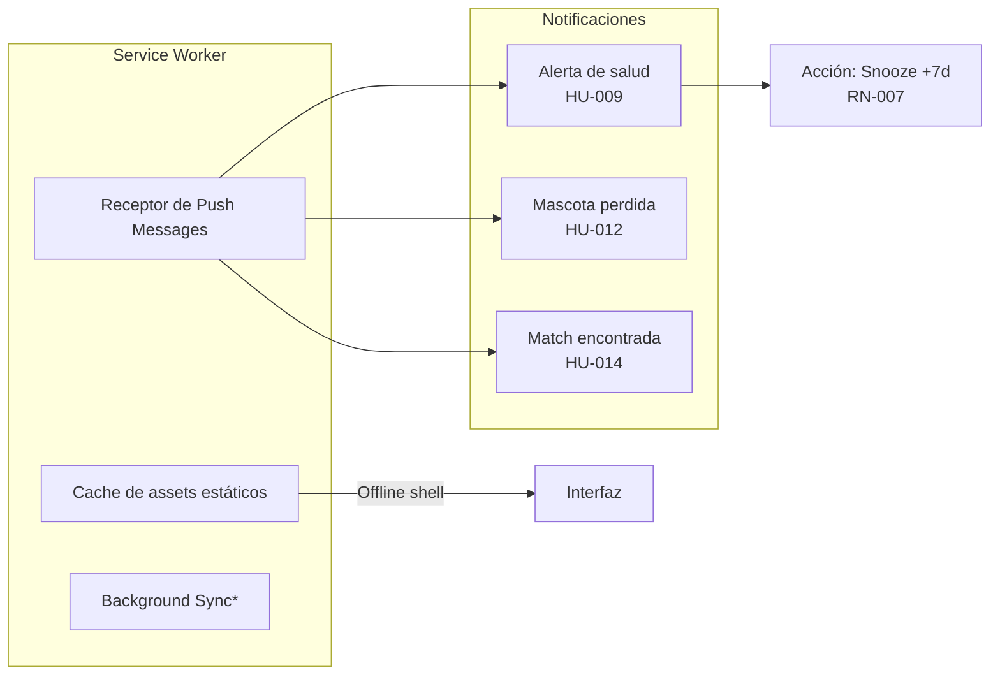
```mermaid
graph LR
    subgraph SW["Service Worker"]
        CACHE[Cache de assets estáticos]
        PUSH[Receptor de Push Messages]
        SYNC[Background Sync*]
    end

    subgraph Notif["Notificaciones"]
        PUSH --> N1[Alerta de salud\nHU-009]
        PUSH --> N2[Mascota perdida\nHU-012]
        PUSH --> N3[Match encontrada\nHU-014]
    end

    CACHE -->|Offline shell| UI[Interfaz]
    N1 --> SNOOZE[Acción: Snooze +7d\nRN-007]
```

---

## 3. Supabase — Arquitectura Interna

### 3.1 Componentes utilizados

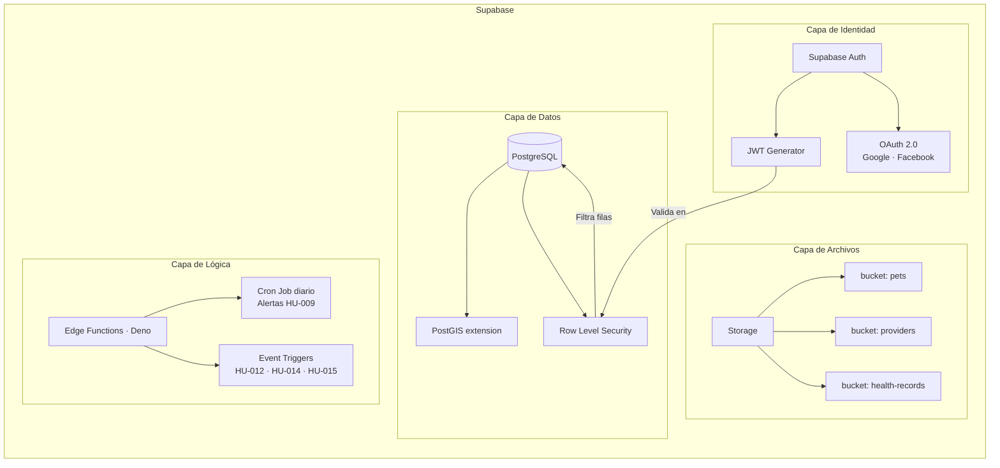
```mermaid
graph TB
    subgraph SB["Supabase"]
        direction TB

        subgraph Data["Capa de Datos"]
            PG[(PostgreSQL)]
            PGS[PostGIS extension]
            RLS[Row Level Security]
            PG --> PGS
            PG --> RLS
        end

        subgraph Identity["Capa de Identidad"]
            SBAUTH[Supabase Auth]
            JWT[JWT Generator]
            OAUTH[OAuth 2.0\nGoogle · Facebook]
            SBAUTH --> JWT
            SBAUTH --> OAUTH
        end

        subgraph Files["Capa de Archivos"]
            STOR[Storage]
            B1[bucket: pets]
            B2[bucket: providers]
            B3[bucket: health-records]
            STOR --> B1
            STOR --> B2
            STOR --> B3
        end

        subgraph Logic["Capa de Lógica"]
            EDF[Edge Functions · Deno]
            CRON[Cron Job diario\nAlertas HU-009]
            TRIGGER[Event Triggers\nHU-012 · HU-014 · HU-015]
            EDF --> CRON
            EDF --> TRIGGER
        end
    end

    JWT -->|Valida en| RLS
    RLS -->|Filtra filas| PG
```

### 3.2 Modelo de base de datos — Dependencias entre tablas

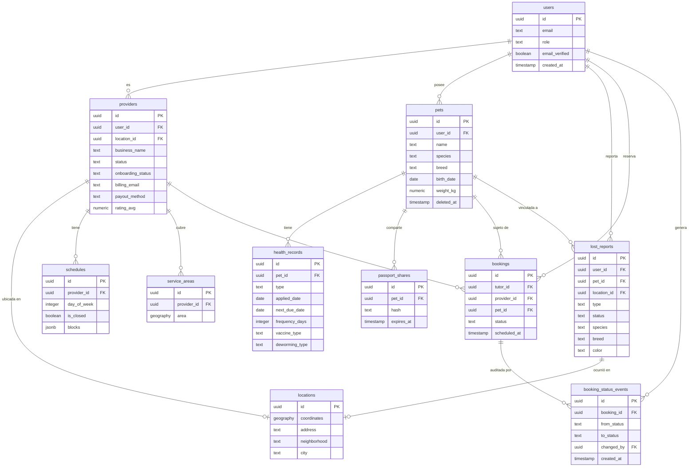
```mermaid
erDiagram
    users {
        uuid id PK
        text email
        text role
        boolean email_verified
        timestamp created_at
    }

    locations {
        uuid id PK
        geography coordinates
        text address
        text neighborhood
        text city
    }

    providers {
        uuid id PK
        uuid user_id FK
        uuid location_id FK
        text business_name
        text status
        text onboarding_status
        text billing_email
        text payout_method
        numeric rating_avg
    }

    pets {
        uuid id PK
        uuid user_id FK
        text name
        text species
        text breed
        date birth_date
        numeric weight_kg
        timestamp deleted_at
    }

    health_records {
        uuid id PK
        uuid pet_id FK
        text type
        date applied_date
        date next_due_date
        integer frequency_days
        text vaccine_type
        text deworming_type
    }

    passport_shares {
        uuid id PK
        uuid pet_id FK
        text hash
        timestamp expires_at
    }

    schedules {
        uuid id PK
        uuid provider_id FK
        integer day_of_week
        boolean is_closed
        jsonb blocks
    }

    service_areas {
        uuid id PK
        uuid provider_id FK
        geography area
    }

    lost_reports {
        uuid id PK
        uuid user_id FK
        uuid pet_id FK
        uuid location_id FK
        text type
        text status
        text species
        text breed
        text color
    }

    bookings {
        uuid id PK
        uuid tutor_id FK
        uuid provider_id FK
        uuid pet_id FK
        text status
        timestamp scheduled_at
    }

    booking_status_events {
        uuid id PK
        uuid booking_id FK
        text from_status
        text to_status
        uuid changed_by FK
        timestamp created_at
    }

    users ||--o{ providers : "es"
    users ||--o{ pets : "posee"
    users ||--o{ lost_reports : "reporta"
    users ||--o{ bookings : "reserva"
    users ||--o{ booking_status_events : "genera"
    providers ||--o| locations : "ubicada en"
    providers ||--o{ schedules : "tiene"
    providers ||--o{ service_areas : "cubre"
    providers ||--o{ bookings : "recibe"
    pets ||--o{ health_records : "tiene"
    pets ||--o{ passport_shares : "comparte"
    pets ||--o{ bookings : "sujeto de"
    pets ||--o{ lost_reports : "vinculada a"
    lost_reports ||--o| locations : "ocurrió en"
    bookings ||--o{ booking_status_events : "auditada por"
```

---

## 4. Autenticación y Autorización

### 4.1 Flujo de autenticación

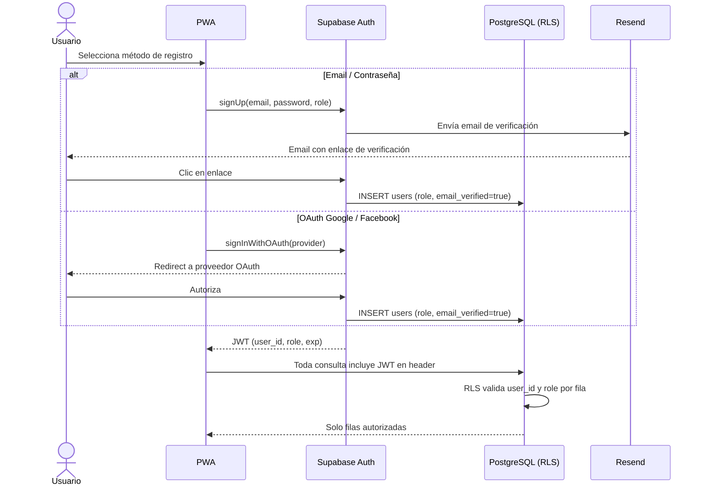
```mermaid
sequenceDiagram
    actor U as Usuario
    participant PWA
    participant AUTH as Supabase Auth
    participant DB as PostgreSQL (RLS)
    participant RS as Resend

    U->>PWA: Selecciona método de registro
    alt Email / Contraseña
        PWA->>AUTH: signUp(email, password, role)
        AUTH->>RS: Envía email de verificación
        RS-->>U: Email con enlace de verificación
        U->>AUTH: Clic en enlace
        AUTH->>DB: INSERT users (role, email_verified=true)
    else OAuth Google / Facebook
        PWA->>AUTH: signInWithOAuth(provider)
        AUTH-->>U: Redirect a proveedor OAuth
        U->>AUTH: Autoriza
        AUTH->>DB: INSERT users (role, email_verified=true)
    end

    AUTH-->>PWA: JWT (user_id, role, exp)
    PWA->>DB: Toda consulta incluye JWT en header
    DB->>DB: RLS valida user_id y role por fila
    DB-->>PWA: Solo filas autorizadas
```

### 4.2 Flujo de aprobación de Proveedor

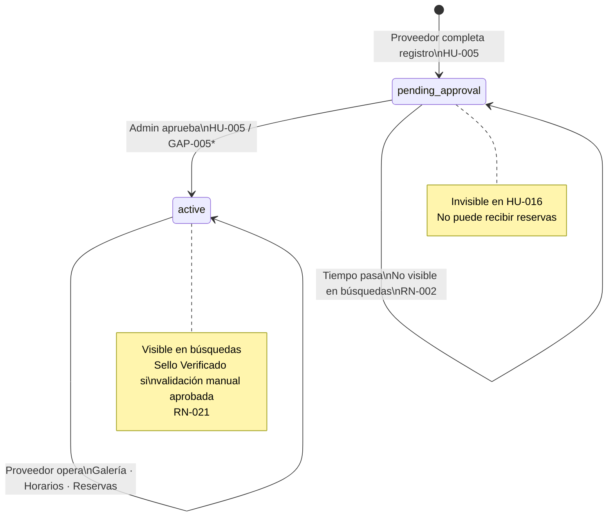
```mermaid
stateDiagram-v2
    [*] --> pending_approval : Proveedor completa registro\nHU-005

    pending_approval --> active : Admin aprueba\nHU-005 / GAP-005*

    pending_approval --> pending_approval : Tiempo pasa\nNo visible en búsquedas\nRN-002

    active --> active : Proveedor opera\nGalería · Horarios · Reservas

    note right of pending_approval
        Invisible en HU-016
        No puede recibir reservas
    end note

    note right of active
        Visible en búsquedas
        Sello Verificado si\nvalidación manual aprobada
        RN-021
    end note
```

### 4.3 Matriz de acceso por rol y ruta

```mermaid
graph LR
    subgraph Anónimo["Sin sesión"]
        R1[/passport/:hash]
        R2[/mapa]
        R3[/encontrada]
    end

    subgraph Tutor["role: tutor"]
        R4[/perfil]
        R5[/mascotas]
        R6[/salud]
        R7[/perdidas]
        R8[/buscar]
        R9[/reservas]
    end

    subgraph Provider["role: provider"]
        R10[/mi-negocio]
        R11[/galeria]
        R12[/horarios]
        R13[/agenda]
    end

    subgraph Admin["role: admin"]
        R14[/admin/proveedores*]
    end
```

---

## 5. Supabase Storage

### 5.1 Estructura de buckets

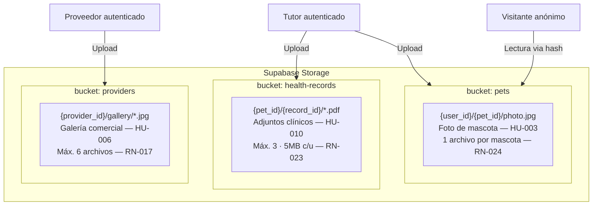
```mermaid
graph TB
    subgraph STR["Supabase Storage"]
        subgraph B1["bucket: pets"]
            P1["{user_id}/{pet_id}/photo.jpg\nFoto de mascota — HU-003\n1 archivo por mascota — RN-024"]
        end

        subgraph B2["bucket: providers"]
            P2["{provider_id}/gallery/*.jpg\nGalería comercial — HU-006\nMáx. 6 archivos — RN-017"]
        end

        subgraph B3["bucket: health-records"]
            P3["{pet_id}/{record_id}/*.pdf\nAdjuntos clínicos — HU-010\nMáx. 3 · 5MB c/u — RN-023"]
        end
    end

    TUTOR[Tutor autenticado] -->|Upload| B1
    TUTOR -->|Upload| B3
    PROV[Proveedor autenticado] -->|Upload| B2
    ANON[Visitante anónimo] -->|Lectura via hash| B1
```

### 5.2 Flujo de subida de archivo

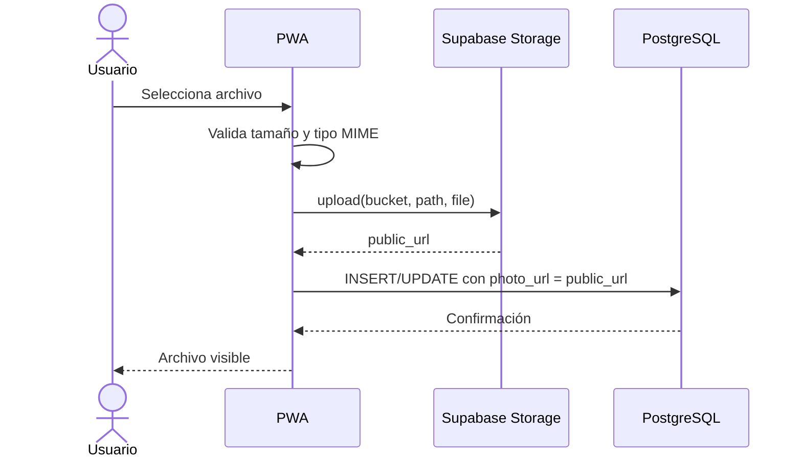
```mermaid
sequenceDiagram
    actor U as Usuario
    participant PWA
    participant STR as Supabase Storage
    participant DB as PostgreSQL

    U->>PWA: Selecciona archivo
    PWA->>PWA: Valida tamaño y tipo MIME
    PWA->>STR: upload(bucket, path, file)
    STR-->>PWA: public_url
    PWA->>DB: INSERT/UPDATE con photo_url = public_url
    DB-->>PWA: Confirmación
    PWA-->>U: Archivo visible
```

---

## 6. Edge Functions — Lógica Serverless

### 6.1 Inventario de Edge Functions

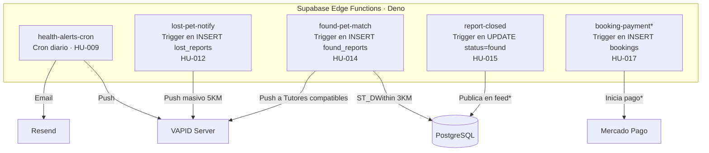
```mermaid
graph TB
    subgraph EF["Supabase Edge Functions · Deno"]
        EF1[health-alerts-cron\nCron diario · HU-009]
        EF2[lost-pet-notify\nTrigger en INSERT lost_reports\nHU-012]
        EF3[found-pet-match\nTrigger en INSERT found_reports\nHU-014]
        EF4[report-closed\nTrigger en UPDATE status=found\nHU-015]
        EF5[booking-payment*\nTrigger en INSERT bookings\nHU-017]
    end

    EF1 -->|Email| RS[Resend]
    EF1 -->|Push| VP[VAPID Server]
    EF2 -->|Push masivo 5KM| VP
    EF3 -->|Push a Tutores compatibles| VP
    EF3 -->|ST_DWithin 3KM| DB[(PostgreSQL)]
    EF4 -->|Publica en feed*| DB
    EF5 -->|Inicia pago*| MP[Mercado Pago]
```

### 6.2 Flujo del cron de alertas de salud (HU-009)

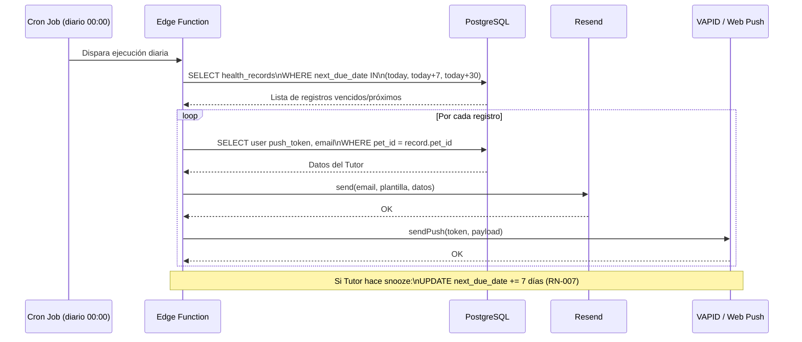
```mermaid
sequenceDiagram
    participant CRON as Cron Job (diario 00:00)
    participant EF as Edge Function
    participant DB as PostgreSQL
    participant RS as Resend
    participant VP as VAPID / Web Push

    CRON->>EF: Dispara ejecución diaria
    EF->>DB: SELECT health_records\nWHERE next_due_date IN\n(today, today+7, today+30)
    DB-->>EF: Lista de registros vencidos/próximos

    loop Por cada registro
        EF->>DB: SELECT user push_token, email\nWHERE pet_id = record.pet_id
        DB-->>EF: Datos del Tutor

        EF->>RS: send(email, plantilla, datos)
        RS-->>EF: OK

        EF->>VP: sendPush(token, payload)
        VP-->>EF: OK
    end

    note over EF,VP: Si Tutor hace snooze:\nUPDATE next_due_date += 7 días (RN-007)
```

### 6.3 Flujo de notificación masiva por mascota perdida (HU-012)

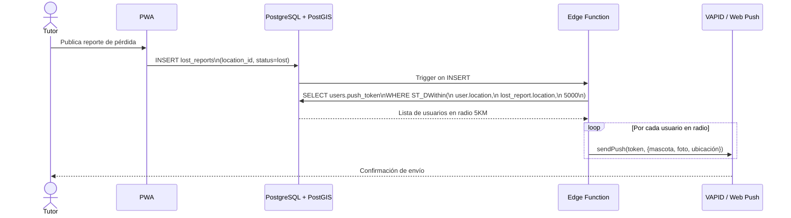
```mermaid
sequenceDiagram
    actor T as Tutor
    participant PWA
    participant DB as PostgreSQL + PostGIS
    participant EF as Edge Function
    participant VP as VAPID / Web Push

    T->>PWA: Publica reporte de pérdida
    PWA->>DB: INSERT lost_reports\n(location_id, status=lost)
    DB->>EF: Trigger on INSERT

    EF->>DB: SELECT users.push_token\nWHERE ST_DWithin(\n  user.location,\n  lost_report.location,\n  5000\n)
    DB-->>EF: Lista de usuarios en radio 5KM

    loop Por cada usuario en radio
        EF->>VP: sendPush(token, {mascota, foto, ubicación})
    end

    VP-->>T: Confirmación de envío
```

### 6.4 Flujo del motor de coincidencias (HU-014)

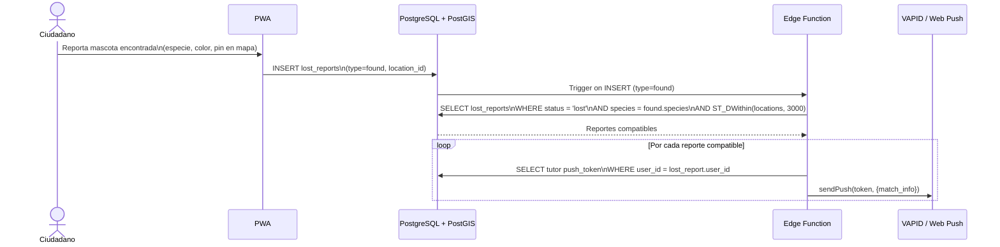
```mermaid
sequenceDiagram
    actor C as Ciudadano
    participant PWA
    participant DB as PostgreSQL + PostGIS
    participant EF as Edge Function
    participant VP as VAPID / Web Push

    C->>PWA: Reporta mascota encontrada\n(especie, color, pin en mapa)
    PWA->>DB: INSERT lost_reports\n(type=found, location_id)
    DB->>EF: Trigger on INSERT (type=found)

    EF->>DB: SELECT lost_reports\nWHERE status = 'lost'\nAND species = found.species\nAND ST_DWithin(locations, 3000)
    DB-->>EF: Reportes compatibles

    loop Por cada reporte compatible
        EF->>DB: SELECT tutor push_token\nWHERE user_id = lost_report.user_id
        EF->>VP: sendPush(token, {match_info})
    end
```

---

## 7. Mercado Pago — Integración de Pagos

### 7.1 Arquitectura del flujo de pago (Fase 2)

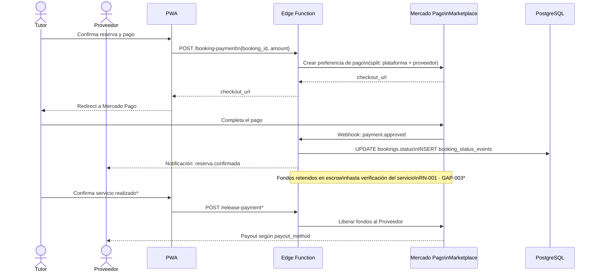
```mermaid
sequenceDiagram
    actor T as Tutor
    actor P as Proveedor
    participant PWA
    participant EF as Edge Function
    participant MP as Mercado Pago\nMarketplace
    participant DB as PostgreSQL

    T->>PWA: Confirma reserva y pago
    PWA->>EF: POST /booking-payment\n{booking_id, amount}
    EF->>MP: Crear preferencia de pago\n(split: plataforma + proveedor)
    MP-->>EF: checkout_url
    EF-->>PWA: checkout_url
    PWA-->>T: Redirect a Mercado Pago

    T->>MP: Completa el pago
    MP->>EF: Webhook: payment.approved
    EF->>DB: UPDATE bookings.status\nINSERT booking_status_events
    EF-->>P: Notificación: reserva confirmada

    note over MP,EF: Fondos retenidos en escrow\nhasta verificación del servicio\nRN-001 · GAP-003*

    T->>PWA: Confirma servicio realizado*
    PWA->>EF: POST /release-payment*
    EF->>MP: Liberar fondos al Proveedor
    MP-->>P: Payout según payout_method
```

### 7.2 Estados del pago y la reserva

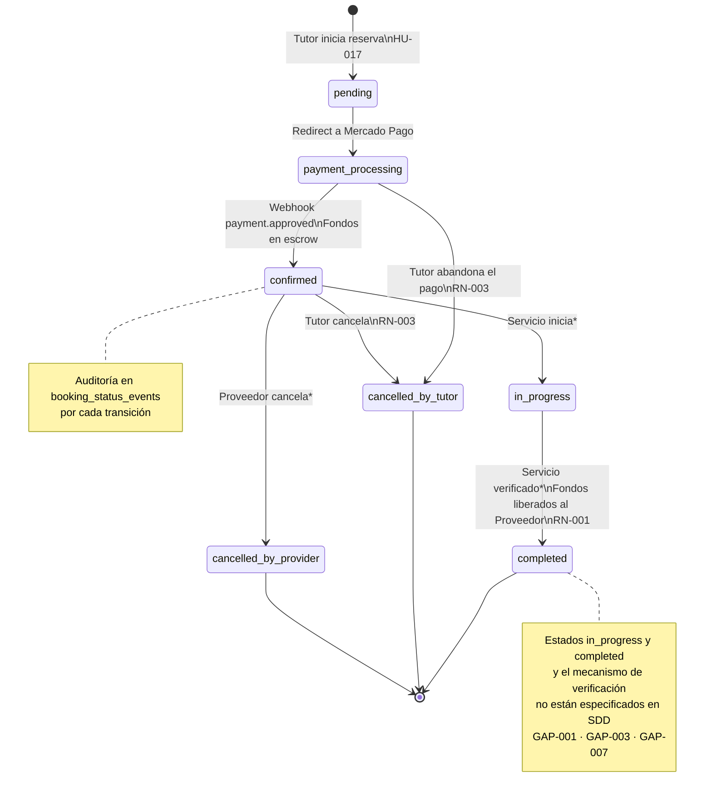
```mermaid
stateDiagram-v2
    [*] --> pending : Tutor inicia reserva\nHU-017

    pending --> payment_processing : Redirect a Mercado Pago

    payment_processing --> confirmed : Webhook payment.approved\nFondos en escrow

    payment_processing --> cancelled_by_tutor : Tutor abandona el pago\nRN-003

    confirmed --> in_progress : Servicio inicia*

    in_progress --> completed : Servicio verificado*\nFondos liberados al Proveedor\nRN-001

    confirmed --> cancelled_by_tutor : Tutor cancela\nRN-003

    confirmed --> cancelled_by_provider : Proveedor cancela*

    completed --> [*]
    cancelled_by_tutor --> [*]
    cancelled_by_provider --> [*]

    note right of confirmed
        Auditoría en booking_status_events
        por cada transición
    end note

    note right of completed
        Estados in_progress y completed
        y el mecanismo de verificación
        no están especificados en SDD
        GAP-001 · GAP-003 · GAP-007
    end note
```

---

## 8. Sistema de Notificaciones

### 8.1 Arquitectura de canales

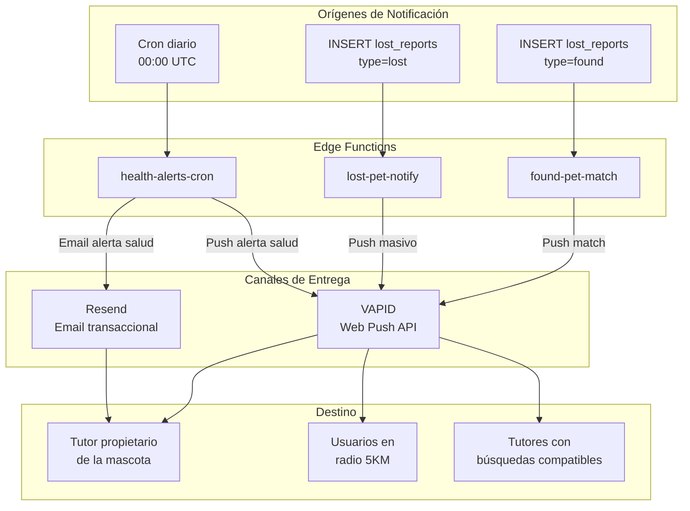
```mermaid
graph TB
    subgraph Origenes["Orígenes de Notificación"]
        O1[Cron diario\n00:00 UTC]
        O2[INSERT lost_reports\ntype=lost]
        O3[INSERT lost_reports\ntype=found]
    end

    subgraph EF["Edge Functions"]
        EF1[health-alerts-cron]
        EF2[lost-pet-notify]
        EF3[found-pet-match]
    end

    subgraph Canal["Canales de Entrega"]
        EMAIL[Resend\nEmail transaccional]
        PUSH[VAPID\nWeb Push API]
    end

    subgraph Destino["Destino"]
        D1[Tutor propietario\nde la mascota]
        D2[Usuarios en\nradio 5KM]
        D3[Tutores con\nbúsquedas compatibles]
    end

    O1 --> EF1
    O2 --> EF2
    O3 --> EF3

    EF1 -->|Email alerta salud| EMAIL --> D1
    EF1 -->|Push alerta salud| PUSH --> D1
    EF2 -->|Push masivo| PUSH --> D2
    EF3 -->|Push match| PUSH --> D3
```

### 8.2 Árbol de decisión para entrega de push

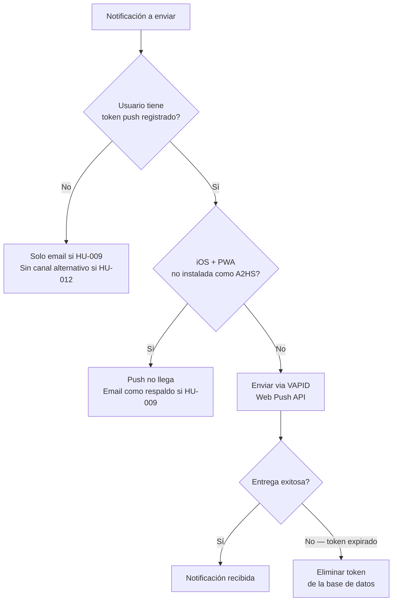
```mermaid
flowchart TD
    A[Notificación a enviar] --> B{Usuario tiene\ntoken push registrado?}
    B -->|No| C[Solo email si HU-009\nSin canal alternativo si HU-012]
    B -->|Sí| D{iOS + PWA\nno instalada como A2HS?}
    D -->|Sí| E[Push no llega\nEmail como respaldo si HU-009]
    D -->|No| F[Enviar via VAPID\nWeb Push API]
    F --> G{Entrega exitosa?}
    G -->|Sí| H[Notificación recibida]
    G -->|No — token expirado| I[Eliminar token\nde la base de datos]
```

---

## 9. Flujos Transversales

### 9.1 Ciclo de vida del pasaporte compartido (HU-011)

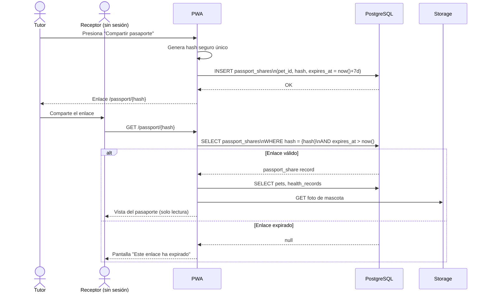
```mermaid
sequenceDiagram
    actor T as Tutor
    actor R as Receptor (sin sesión)
    participant PWA
    participant DB as PostgreSQL
    participant STR as Storage

    T->>PWA: Presiona "Compartir pasaporte"
    PWA->>PWA: Genera hash seguro único
    PWA->>DB: INSERT passport_shares\n(pet_id, hash, expires_at = now()+7d)
    DB-->>PWA: OK
    PWA-->>T: Enlace /passport/{hash}

    T->>R: Comparte el enlace

    R->>PWA: GET /passport/{hash}
    PWA->>DB: SELECT passport_shares\nWHERE hash = {hash}\nAND expires_at > now()

    alt Enlace válido
        DB-->>PWA: passport_share record
        PWA->>DB: SELECT pets, health_records
        PWA->>STR: GET foto de mascota
        PWA-->>R: Vista del pasaporte (solo lectura)
    else Enlace expirado
        DB-->>PWA: null
        PWA-->>R: Pantalla "Este enlace ha expirado"
    end
```

### 9.2 Ciclo de vida del reporte de mascota perdida

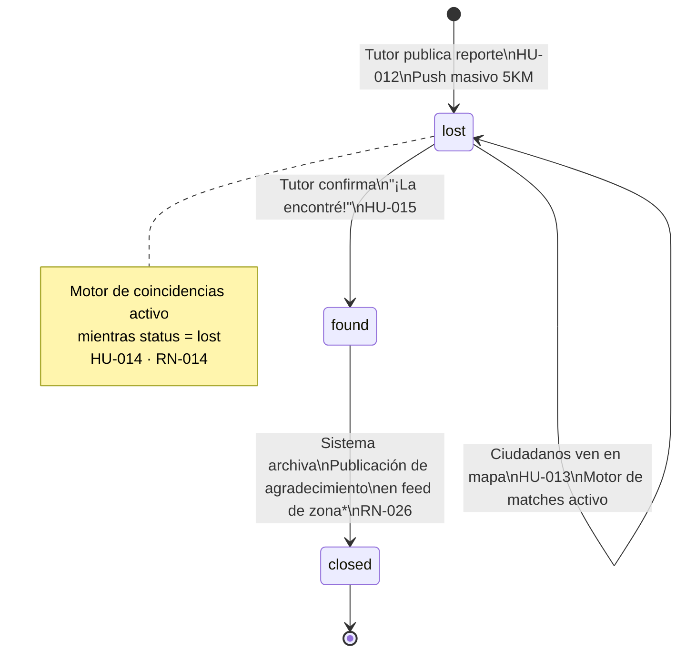
```mermaid
stateDiagram-v2
    [*] --> lost : Tutor publica reporte\nHU-012\nPush masivo 5KM

    lost --> lost : Ciudadanos ven en mapa\nHU-013\nMotor de matches activo

    lost --> found : Tutor confirma\n"¡La encontré!"\nHU-015

    found --> closed : Sistema archiva\nPublicación de agradecimiento\nen feed de zona*\nRN-026

    closed --> [*]

    note right of lost
        Motor de coincidencias activo
        mientras status = lost
        HU-014 · RN-014
    end note
```

---

## 10. Resumen de Tecnologías por Capa

```mermaid
graph TB
    subgraph L1["Capa de Presentación"]
        PWA["PWA\nService Worker · Web App Manifest\nGeolocation API · Web Push API"]
    end

    subgraph L2["Capa de Identidad"]
        SBAUTH["Supabase Auth\nJWT · OAuth 2.0 Google/Facebook\nEmail+Password · Email Verification"]
    end

    subgraph L3["Capa de Lógica"]
        EDF["Supabase Edge Functions\nDeno Runtime\nCron Jobs · Event Triggers"]
    end

    subgraph L4["Capa de Datos"]
        PG["PostgreSQL\nPostGIS · GIST Index\nRow Level Security"]
    end

    subgraph L5["Capa de Archivos"]
        STOR["Supabase Storage\nbucket: pets\nbucket: providers\nbucket: health-records"]
    end

    subgraph L6["Servicios Externos"]
        MP["Mercado Pago Marketplace\nEscrow · Split de pagos · Payout"]
        RS["Resend\nEmail transaccional"]
        VAPID["VAPID · Web Push API\nPush notifications"]
    end

    L1 <-->|REST + SDK + JWT| L2
    L1 <-->|REST + SDK + JWT| L4
    L1 <-->|Upload/Download| L5
    L3 <-->|SQL| L4
    L3 -->|SMTP| RS
    L3 -->|Push| VAPID
    L3 <-->|API| MP
    L2 -->|UUID como FK| L4
```

---

## 11. Consideraciones de Seguridad Arquitectónica

Derivadas del SDD y los ADRs. Ver `docs/architecture/security.md` para detalle completo.

```mermaid
graph TB
    subgraph Controles["Controles de Seguridad"]
        C1[JWT firmado por Supabase Auth\nTodas las requests autenticadas]
        C2[Row Level Security\nAislamiento de datos por user_id*]
        C3[Hash seguro en PassportShare\nAcceso público acotado a 7 días · RN-008]
        C4[HTTPS obligatorio\nToda la comunicación PWA ↔ Supabase]
        C5[Mercado Pago gestiona PCI DSS\nAPPATITAS no almacena datos de tarjeta]
        C6[Supabase Storage policies\nControl de lectura/escritura por bucket]
    end

    subgraph Pendientes["Pendientes de Definición · GAP-014"]
        P1[Políticas RLS específicas\npor tabla]
        P2[Cifrado de CUIT/DNI\nen base de datos]
        P3[Política de retención\nde datos personales]
    end
```

---

## 12. Entornos

| Variable | Staging | Producción |
|---|---|---|
| **Supabase Project** | Proyecto separado | Proyecto separado |
| **Mercado Pago** | Credenciales Sandbox | Credenciales Live |
| **Resend** | Dominio de prueba | Dominio verificado de producción |
| **OAuth Google/Facebook** | App de desarrollo | App revisada y aprobada |
| **PostGIS** | Misma extensión | Misma extensión |
| **VAPID Keys** | Par de claves staging | Par de claves producción |
